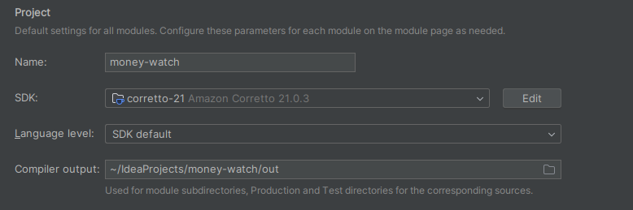
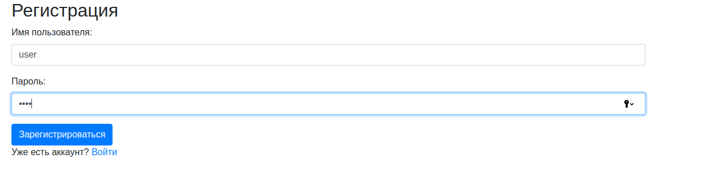

# Запуск

* Для запуска требуется запущенная БД postgres. Для этого в docker поднимаем БД с помощью  

    ``docker run --name my-postgres -e POSTGRES_USER=postgres -e POSTGRES_PASSWORD=postgres -e POSTGRES_DB=moneywatch -p 5432:5432 -d postgres:latest
    ``

* Также вам потребуется 21 java. Например, с помощью intelli idea

* Для входа в приложение необходимо зарегистрироваться по адресу http://localhost:8080/api/auth/register

* Далее необходимо войти
* http://localhost:8080/api/auth/login
* .png)
